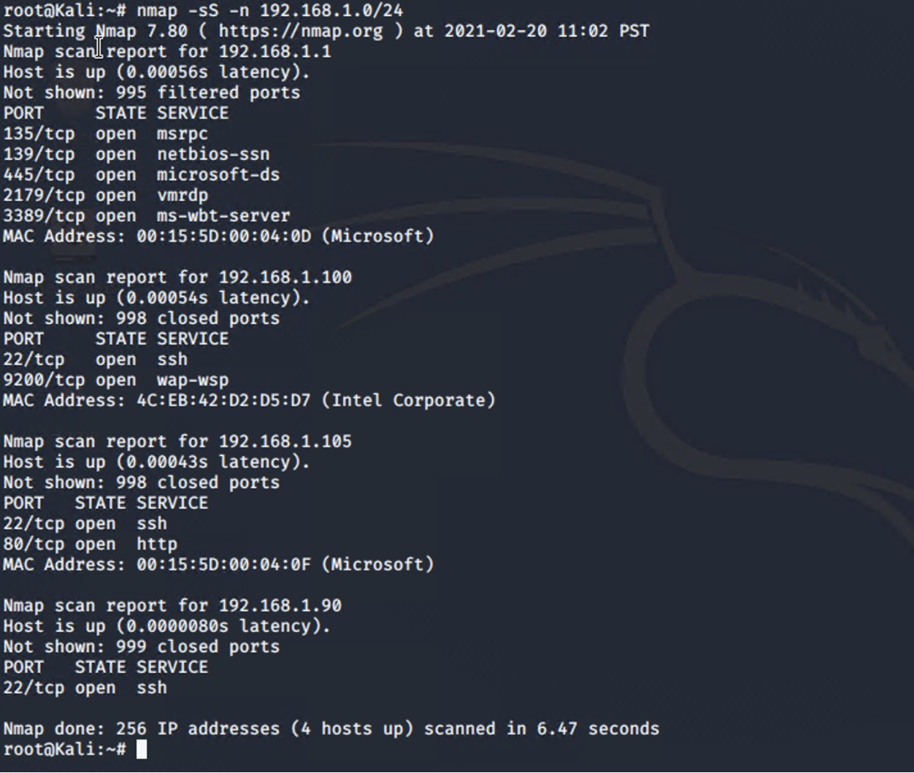
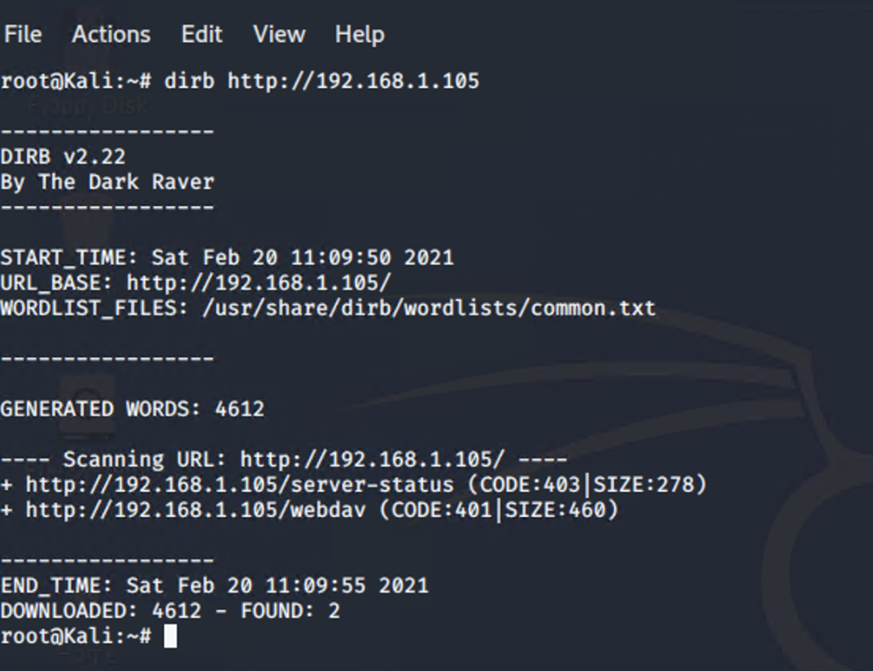
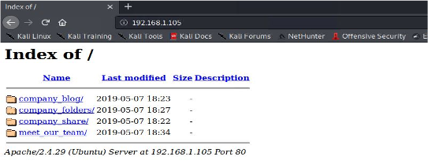
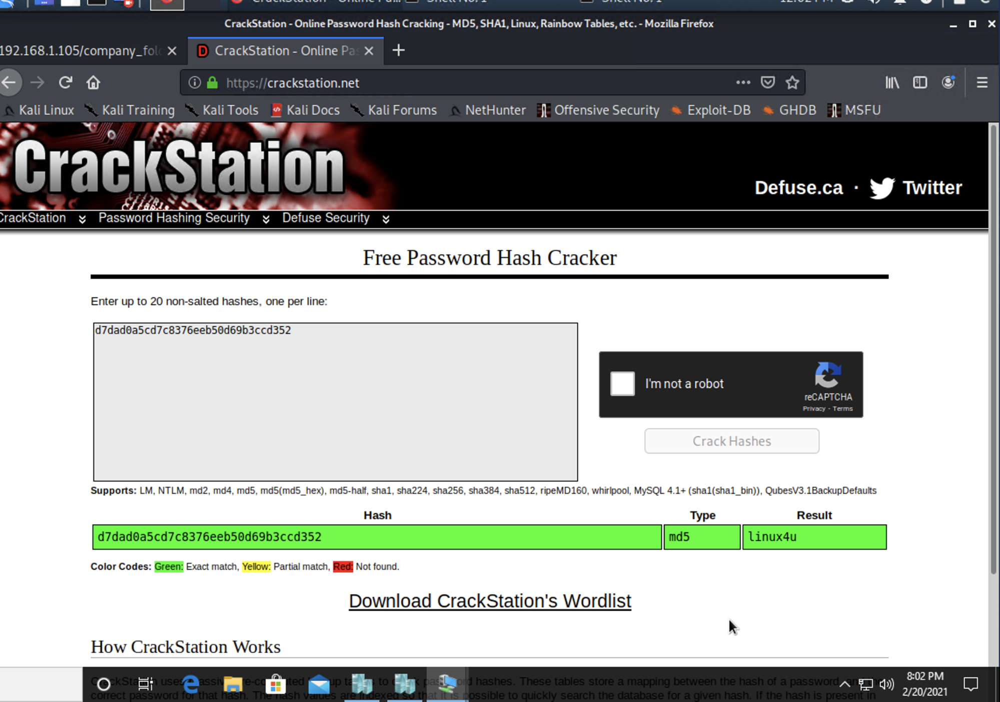
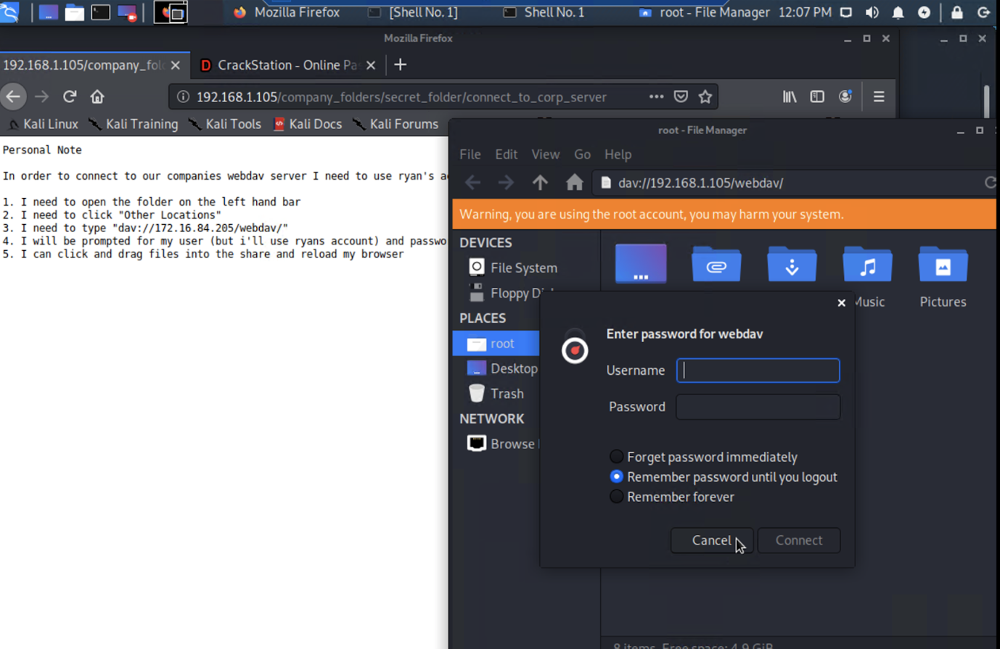
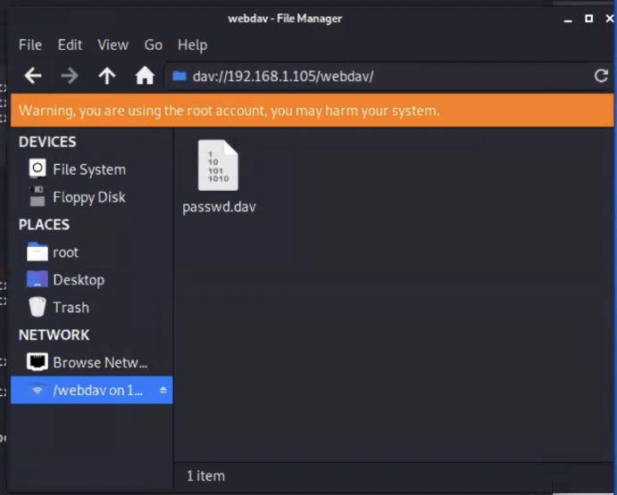
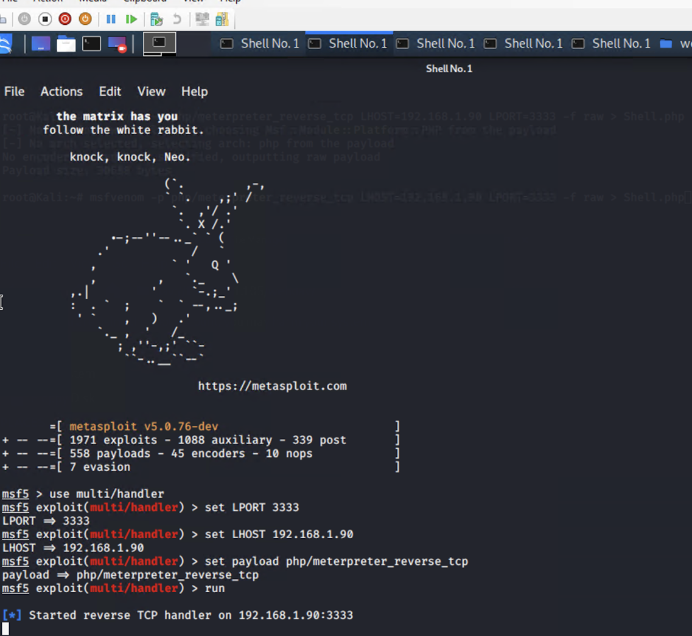
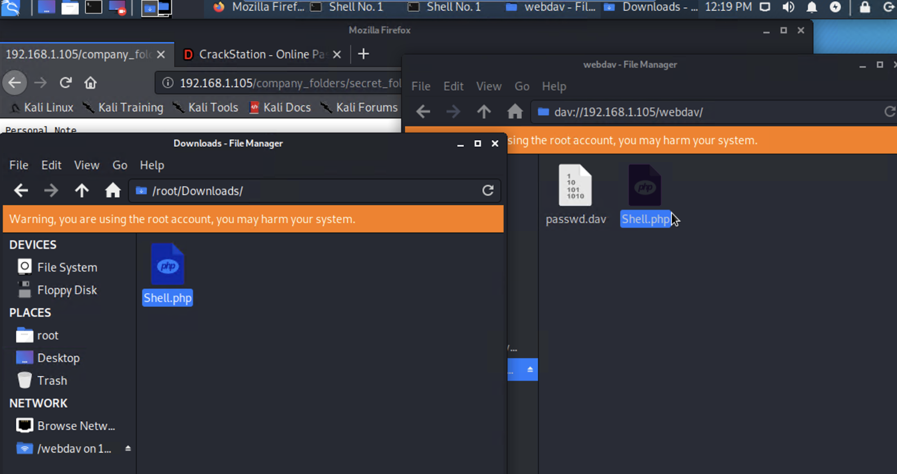

# Day 1 Activity File: Red Team
#
### ELK Server Setup Instructions
#
- As the you attack a web server today, it will send all of the attack info to an ELK server.
* The following setup commands need to be run, before the attack takes place in order to make sure the server is collecting logs.
* Be sure to complete these steps before starting the attack instructions.
#
### Instructions
#
* Double click on the 'HyperV Manager' Icon on the Desktop to open the HyperV Manager.
* Choose the Capstone machine from the list of Virtual Machines and double-click it to get a terminal window.
* Login to the machine using the credentials: vagrant:tnargav
* Switch to the root user with sudo su
#
### Setup Filebeat
#
Run the following commands:
```
filebeat modules enable apache
filebeat setup
```

The output should look like this:


#
### Setup Metricbeat
#
Run the following commands:
```
metricbeat modules enable apache
metricbeat setup
```
The output should look like this:


#
### Setup Packetbeat
#
Run the following command:
```
packetbeat setup
The output should look like this:
```
#

Restart all 3 services. Run the following commands:
```
systemctl restart filebeat
systemctl restart metricbeat
systemctl restart packetbeat
```
These restart commands should not give any output:

* Once all three of these have been enabled, close the terminal window for this machine and proceed with your attack.

This how to check if Kibana is running:


#

### Attack!

Today, you will act as an offensive security Red Team to exploit a vulnerable Capstone VM.
You will need to use the following tools, in no particular order:

* Firefox
* Hydra
* Nmap
* John the Ripper
* Metasploit
* curl
* MSVenom

#

# Setup

Your entire attack will take place using the Kali Linux Machine.

* Inside the HyperV Manager, double-click on the Kali machine to bring up the VM login window.
* Login with the credentials: root:toor

#

# Instructions

Complete the following to find the flag:

* Discover the IP address of the Linux web server.
 
 
 
* Locate the hidden directory on the web server.
   * Hint: Use a browser to see which web pages will load, and/or use a tool like dirb to find URLs on the target site.


<<<<<<< HEAD:Day 1 - Red Team.md



=======

>>>>>>> a525b4392a7115cfa58b4f194e3d8674210f65ef:README.md

* Brute force the password for the hidden directory using the hydra command:
   * Hint: You may need to use gunzip to unzip rockyou.txt.gz before running Hydra.


* Hint: hydra -l <username> -P <wordlist> -s <port> -f -vV <victim.server.ip.address> http-get <path/to/secret/directory>


* Break the hashed password with the Crack Station website or John the Ripper.



* Connect to the server via WebDav.
   * Hint: Look for WebDAV connection instructions in the file located in the secret directory. Note that these instructions may have an old IP Address in them, you will need to use the IP address you have discovered.




* Upload a PHP reverse shell payload.
   * Hint: Try using your scripting skills! MSVenom may also be helpful.




***Above you created the shell with that command in downloads in the screenshot below you are moving it to the website

 


* Execute payload that you uploaded to the site to open up a meterpreter session.

***To activate the session you must click on the Shell.php and go back to the first window where you strted the payload. Correct execution shows up like this:
 


* Find and capture the flag.
<<<<<<< HEAD:Day 1 - Red Team.md
 
=======

>>>>>>> a525b4392a7115cfa58b4f194e3d8674210f65ef:README.md


#
